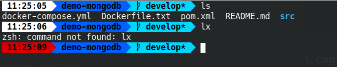
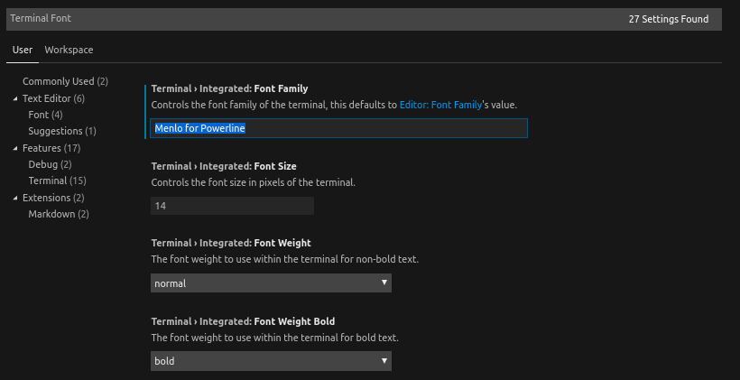

# Introduction 

## 1. Copy inside ~/.oh-my-zsh/theme/
    cp paxton.zsh-theme ~/.oh-my-zsh/themes/paxton.zsh-theme

## 2. Modify ~/.zshrc
    vi .zshrc

    ZSH_THEME="paxton"

## 3. Update configuration
    source .zshrc 

# How to resolve some issues with fonts

## 1. With integrated terminal in visual code

### 1.1. Get powerline font

    git clone https://github.com/abertsch/Menlo-for-Powerline.git

### 1.2. Then move a font to your fonts folder

    sudo mv Menlo*.ttf /usr/share/fonts

### 1.3. Update vscode configuration

## 2. With gnome ubuntu

    sudo apt-get install fonts-powerline
